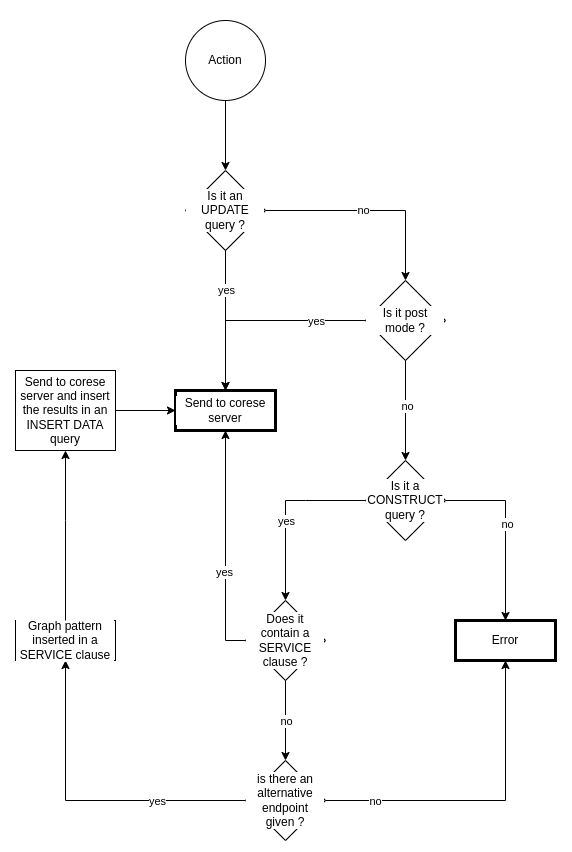

# IndeGx engine

## Library used

The IndeGx engine is coded in Typescript and uses mainly the following libraries to handle RDF data:

- [rdflib](https://linkeddata.github.io/rdflib.js/doc/)
- [graphy](https://graphy.link)
- [sparqljs](https://github.com/RubenVerborgh/SPARQL.js)

## Behaviour

### Input

### Traces

### Output

### Rule application

#### Order of application

#### Query rewriting

