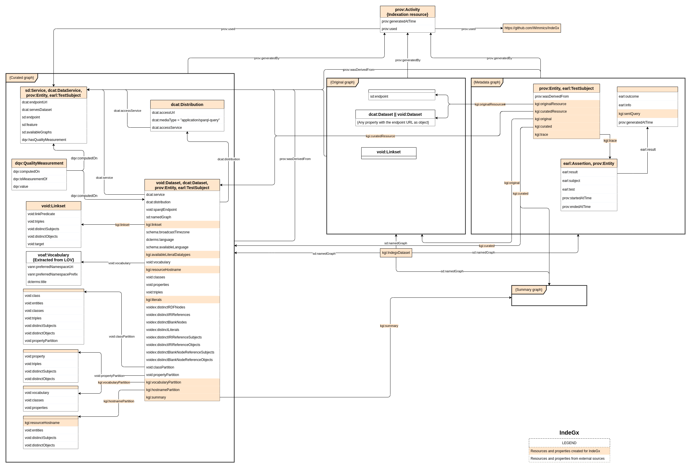

# Extraction rules for IndeGx

## IndeGx KG data structure

For one endpoint indexed, the data generated by IndeGx is composed of four graphs: the asserted graph, the computed graph, the metadata graph, and the summary graph. The following schema presents the abridged structure of the data generated using IndeGx rules for the indexation of one endpoint.

For each endpoint treated, IndeGx creates an indexation resource, shown at the top of the schema, and a metadata graph, shown on the right of the schema. Both resources are linked to the other three graphs that IndeGx generated from the endpoint.

### Asserted Graph

For one endpoint, the asserted graph contains the metadata that are asserted by the endpoint itself. IndeGx searches for an endpoint description resource subject of the property `sd:endpoint` and connected to the URL of the endpoint. If it finds one, IndeGx extracts all triples including this resource. In the same manner, IndeGx extracts all dataset description resources, that are instances of either `dcat:Dataset` or `void:Dataset`, connected to the endpoint URL. The triples including these resources are also added to the asserted graph.

The extraction of the content of the asserted graph is directed by the rules found in the [`extraction/asserted`](./extraction/asserted/) folder of the IndeGx rules repository.

### Computed Graph

The computed graph contains the metadata that is computed by IndeGx. IndeGx creates separate endpoint and dataset description resources from the one found in the asserted graph.

The [`extraction/computed`](./extraction/computed/) folder of the IndeGx rules repository contains the rules that are applied to compute the basic description of a dataset from an endpoint. The results of these rules are added to the computed graph as properties of the instances of either `sd:Service` or `void:Dataset`.

The [`check`](./check/) folder of the IndeGx rules repository contains the rules that are applied to evaluate different quality indicators on the endpoint and its content. The results of these rules are added to the computed graph as instances of `dqv:QualityMeasurement`, shown in the curated graph, on the left, second from the top.

The [`sparqles`](./sparqles/) folder of the IndeGx rules repository contains the rules that are applied to test the SPARQL endpoint compliance of the endpoint using queries directly taken or inspired by [SPARQLES](https://sparqles.ai.wu.ac.at/). The results of these rules are added to the computed graph as the object of the property `sd:feature` of the endpoint description resource.

The [`statistics`](./statistics/) folder of the IndeGx rules repository contains the rules that are applied to compute statistics on the content of the endpoint. Part of the queries used in those rules are inspired by different approaches such as [SPORTAL](https://doi.org/10.4018/IJSWIS.2016070105) or [LOUPE](http://loupe.linkeddata.es/loupe/index.jsp). Among the results of these rules are the different partitions, shown bottom left of the curated graph, as defined by the VoID vocabulary.

### Summary Graph

The summary graph contains a kind of summary of the structure of the data available through the endpoint. It is composed of triples generated by the application of the rules in the [`summary`](./summary/) folder. Its structure is inspired by the [HiBiscUs summary](https://doi.org/10.1007/978-3-319-07443-6_13). For each triple from the endpoint, the summary graph contains a triple with the same property but the subjects or objects are replaced by their hostnames if they are IRIs or by `"lit"` if they are literals.

### Metadata Graph

The metadata graph contains metadata on the indexation process itself. It describes the different rules applied and contains a trace of the query sent and its outcome. The trace of a query is described using the EARL vocabulary.
