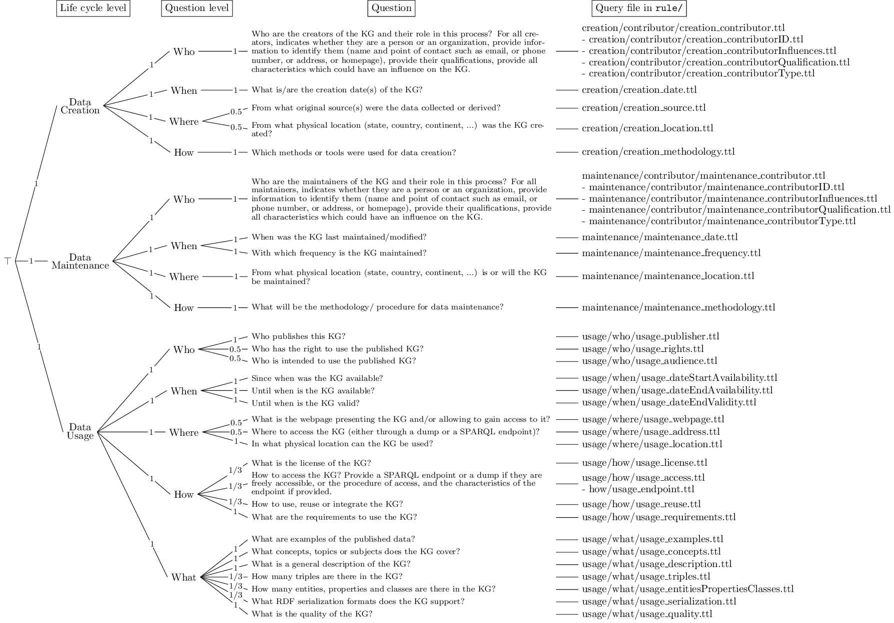

# KG Accountability
This work aims to measure the accountability of RDF graphs. To do so, we define accountability requirements as SPARQL queries. Then, we evaluate many Knowledge Graphs (KG) by querying public SPARQL endpoints using the [IndeGx framework](https://github.com/Wimmics/dekalog). To use IndeGx, we provide a new set of rules dedicated to accountability.
This work is part of the [DeKalog project](https://dekalog.univ-nantes.fr).

## Experiments
This code is made to be used along with [IndeGx](https://github.com/Wimmics/dekalog), was used for these experiments.
The catalog of SPARQL endpoints used for our experiments is [catalogs/](catalogs/). It is taken from IndeGx.

To evaluate KGs, we proceed in several steps. Only the first one queries distant SPARQL endpoints, the rest is performed locally.
1. First, triples corresponding to the metadata of the evaluated KG are extracted using queries in folder [nonTrivialExtractionRules/](nonTrivialExtractionRules/).
2. Then, these extracted triples are saturated by adding equivalent classes and properties, as defined in [equivalencesRules/](equivalencesRules/). The equivalences used are listed [here](/docs/equivalences.md).
3. The KG is evaluated according to this saturated metadata: [rules/](rules/).
4. Finally, queries in [score_computing_rules/](score_computing_rules/) enable to compute the score of a questions made of a the successions of queries, and then to obtain the different scores of accountability on each aspect of the hierarchy, and the global score of accountability.

A summary of the results is available here: [results/](results/).

## To Cite this Work
- J. Andersen, S. Cazalens, P. Lamarre, and P. Maillot, "[A Framework to Assess Knowledge Graphs Accountability](https://ieeexplore.ieee.org/document/10350099)," in 2023 IEEE International Conference on Web Intelligence and Intelligent Agent Technology (WI-IAT), IEEE, 2023, pp. 213–220.
- J. Andersen, S. Cazalens, and P. Lamarre, "[Assessing knowledge graphs accountability](https://2023.eswc-conferences.org/wp-content/uploads/2023/05/paper_Andersen_2023_Assessing.pdf)," in The Semantic Web: ESWC 2023 Satellite Events, Cham: Springer Nature Switzerland, 2023, pp. 37–42.*
  
**This last work relies on a previous experiment. All catalogs, rules and results of this paper are available in this version of the repository: [v1.0](https://github.com/Jendersen/KG_accountability/tree/v1.0).*

## Description of the Hierarchy and Requirements about Accountability

The accountability requirements has been adapted from the [LiQuID metadata model](https://ceur-ws.org/Vol-2716/paper5.pdf), both its hierarchical structure and the questions illustrating each field of this structure. The organized requirements we defined is illustrated in the following Figure. The correspondance between the LiQuID questions and our adaptation in the context of Knowledge Graphs is available [here](docs/README.md). For a summary of the required properties for each question, see [this file](docs/questions_and_properties.md).

The folder [information_need/](information_need/) contains an RDF representation of these requirements and hierarchy. To do so, the ontology SIN-O is defined and used.
