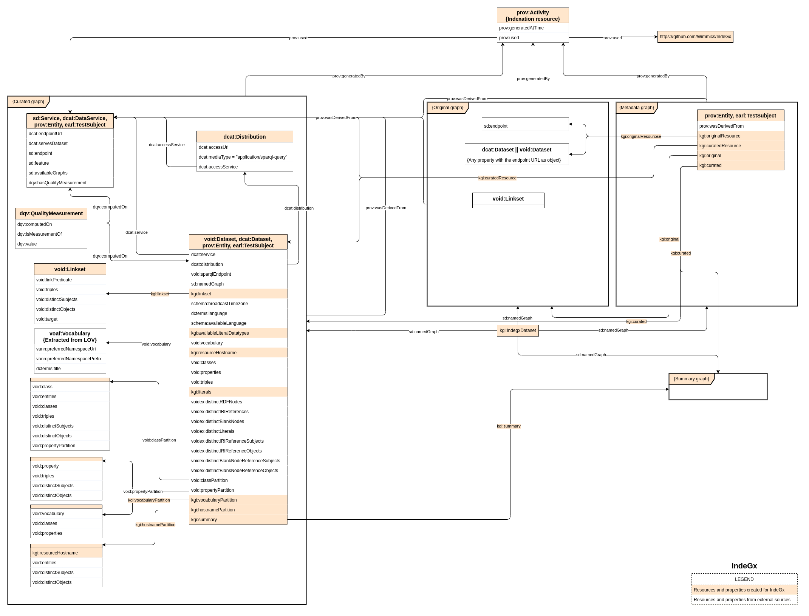

# Extraction rules for IndeGx

## IndeGx vocabulary

The IndeGx vocabulary has two goals:

- To extend Manifest and VoID to make it possible to express complex rules for metadata generation by the IndeGx engine.
- To define resources for the expression of metadata about endpoints and datasets that are not available in well-known vocabularies.

The details of the vocabulary are presented on a [dedicated page](./indegx_vocabulary.md).

## Rule structure

The declaration of extraction rules follows the structure described in the following schema. In color are the elements defined by the IndeGx vocabulary.

The elements of the metadata generation rules are called generation assets, and are instances of `kgi:GenerationAsset`. They are organized in a tree-like structure. Each generation asset can be applied by the IndeGx engine, either by the application of a list of other generation assets it contains of by the application of SPARQL queries it contains.

The application of a generation asset can be put on hold and wait for the application of other assets before being applied. This condition is expressed as a list of generation assets objects of the property `kgi:requiredAssets`. Note that the usage of this property makes it possible to declare loops in the tree-like structure of the generation assets. Currently, there is no mechanism to detect and prevent loops in the IndeGx engine.

### Manifest: the central file

Metadata generation rules are centered around the definition of a manifest, by convention with a file name containing `manifest`. The manifest always contains one instance of `mf:Manifest`. This instance may give a list of sub-manifests as object of the `mf:include` property. It also may give the list of entries it will apply as the object of the property `mf:entries`.

### Entries and Test files

Entries are instances of `mf:ManifestEntry` and `earl:TestCase`. By convention, their URIs correspond to the address of an RDF file which contains the description of the test associated with the entry. The generation assets that are applied depending on the result of the test are listed as objects of the properties `kgi:onSuccess` and `kgi:onFailure`.

The test can be either an instance of `kgi:TestQuery` or `kgi:DummyTest`. A `kgi:TestQuery` instance must give a SPARQL query as the object of `kgi:query` and it can precise an endpoint to send the query to different from the one being treated. A test instance of `kgi:DummyTest` represents a test that always succeeds.

### Actions

Actions are instances of `kgi:Action`. In the tree-like structure of the metadata generation rules, they are the leaf nodes. An action must give a SPARQL query as the object of the property `mf:action`. By convention, the action is generally a blank node. The SPARQL query is the one that will be executed by the IndeGx engine to generate the metadata. By convention, it is a SPARQL UPDATE query or a CONSTRUCT query. As for the test, the action can precise an endpoint to send the query to different from the one being treated using `kgi:endpoint`. An action can also precise the timeout allocated to the execution of the query, as the object of the property `kgi:timeout`. The action can also give the IndeGx engine a size of pagination to apply to the query, as the object of the property `kgi:recommendedPagination`.

## IndeGx KG data structure

The IndeGx KG is composed of four graphs: the asserted graph, the computed graph, the metadata graph, and the summary graph. The following schema presents the structure of the data generated using IndeGx rules for the indexation of one endpoint.

For each endpoint treated, IndeGx creates an indexation resource, shown at the top of the schema, and a metadata graph, shown on the right of the schema. Both resources are linked to the other three graphs that IndeGx generated from the endpoint.

### Asserted Graph

For one endpoint, the asserted graph contains the metadata that are asserted by the endpoint itself. IndeGx searches for an endpoint description resource subject of the property `sd:endpoint` and is connected to the URL of the endpoint. If it finds one, IndeGx extracts all triples including this resource. In the same manner, IndeGx extracts all dataset description instances of either `dcat:Dataset` or `void:Dataset` connected to the endpoint. The triples including these resources are also added to the asserted graph.

The extraction of the content of the asserted graph is directed by the rules found in the [`extraction/asserted`](./extraction/asserted/) folder of the IndeGx rules repository.

### Computed Graph

The computed graph contains the metadata that is computed by IndeGx. It is composed of the triples generated by the application of the generation assets of the metadata generation rules. IndeGx creates separate endpoint and dataset description resources from the one found in the asserted graph.

The [`extraction/computed`](./extraction/computed/) folder of the IndeGx rules repository contains the rules that are applied to compute the basic description of a dataset from an endpoint. The results of these rules are added to the computed graph as properties of the instances of either `sd:Service` or `void:Dataset`.

The [`check`](./check/) folder of the IndeGx rules repository contains the rules that are applied to evaluate different quality indicators on the endpoint and its content. The results of these rules are added to the computed graph as instances of `dqv:QualityMeasurement`, shown in the curated graph, on the left, second from the top.

The [`sparqles`](./sparqles/) folder of the IndeGx rules repository contains the rules that are applied to test the SPARQL endpoint compliance of the endpoint using queries directly taken or inspired by [SPARQLES](https://sparqles.ai.wu.ac.at/). The results of these rules are added to the computed graph as the object of the property `sd:feature` of the endpoint description resource.

The [`statistics`](./statistics/) folder of the IndeGx rules repository contains the rules that are applied to compute statistics on the content of the endpoint. Part of the queries used in those rules are inspired by different approaches such as [SPORTAL](https://doi.org/10.4018/IJSWIS.2016070105) or [LOUPE](http://loupe.linkeddata.es/loupe/index.jsp). Among the results of these rules are the different partitions, shown bottom left of the curated graph, as defined by the VoID vocabulary.

### Summary Graph

The summary graph contains a kind of summary of the structure of the data available through the endpoint. It is composed of triples generated by the application of the rules in the [`summary`](./summary/) folder. Its structure is inspired by the [HiBiscUs summary](https://doi.org/10.1007/978-3-319-07443-6_13). For each triple from the endpoint, the summary graph contains a triple with the same property but the subjects or objects are replaced by their hostnames if they are IRIs or by `"lit"` if they are literals.

### Metadata Graph

The metadata graph contains metadata on the indexation process itself. It describes the different rules applied and contains a trace of the query sent and its outcome. The traces of a query is described using the EARL vocabulary.
