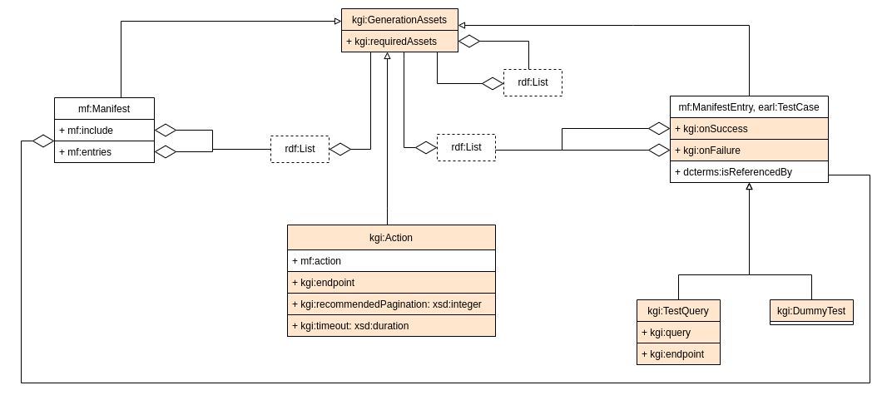

# Extraction rules for IndeGx

## IndeGx vocabulary

TODO: extends Manifest, VoID
TODO: Schema image

The detail of the vocabulary are presented it a [dedicated page](./indegx_vocabulary.md).

## Rule structure

### Manifest: the central file

### Test files

### Action definition in the manifest

## IndeGx KG data structure

TODO: Schema image

### Asserted Graph

### Computed Graph

### Metadata Graph

### Summary Graph
