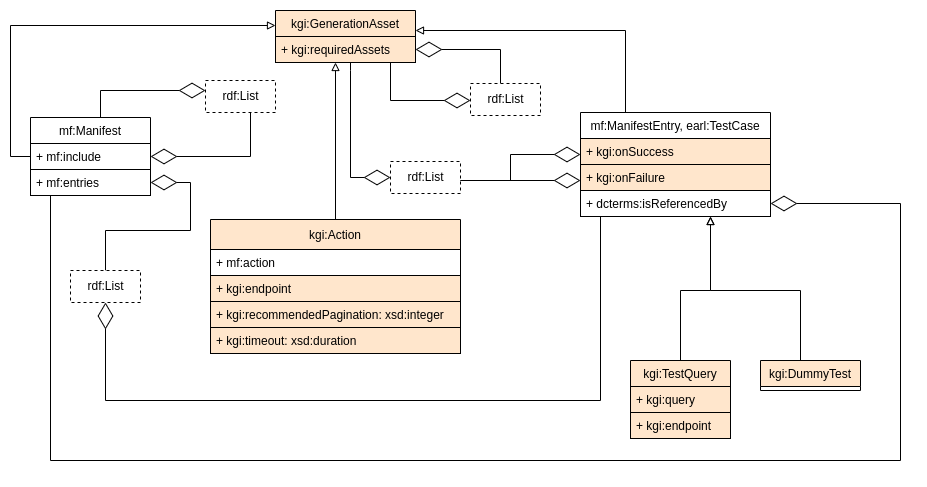

# Extraction rules for IndeGx

## IndeGx vocabulary

The IndeGx vocabulary has two goals:

- To extend Manifest and VoID to make it possible to express complex rules for metadata generation by the IndeGx engine.
- To define resources for the expression of metadata about endpoints and datasets that are not available in well-known vocabularies.

The details of the vocabulary are presented on a [dedicated page](./indegx_vocabulary.md).

## Rule structure

The declaration of extraction rules follows the structure described in the following schema. In color are the elements defined by the IndeGx vocabulary.

The elements of the metadata generation rules are called generation assets, and are instances of `kgi:GenerationAsset`. They are organized in a tree-like structure. Each generation asset can be applied by the IndeGx engine, either by the application of a list of other generation assets it contains of by the application of SPARQL queries it contains.

The application of a generation asset can be put on hold and wait for the application of other assets before being applied. This condition is expressed as a list of generation assets objects of the property `kgi:requiredAssets`. Note that the usage of this property makes it possible to declare loops in the tree-like structure of the generation assets. Currently, there is no mechanism to detect and prevent loops in the IndeGx engine.

### Manifest: the central file

Metadata generation rules are centered around the definition of a manifest, by convention with a file name containing `manifest`. The manifest always contains one instance of `mf:Manifest`. This instance may give a list of sub-manifests as object of the `mf:include` property. It also may give the list of entries it will apply as the object of the property `mf:entries`.

### Entries and Test files

Entries are instances of `mf:ManifestEntry` and `earl:TestCase`. By convention, their URIs correspond to the address of an RDF file which contains the description of the test associated with the entry. The generation assets that are applied depending on the result of the test are listed as objects of the properties `kgi:onSuccess` and `kgi:onFailure`.

The test can be either an instance of `kgi:TestQuery` or `kgi:DummyTest`. A `kgi:TestQuery` instance must give a SPARQL query as the object of `kgi:query` and it can precise an endpoint to send the query to different from the one being treated. A test instance of `kgi:DummyTest` represents a test that always succeeds.

### Actions

Actions are instances of `kgi:Action`. In the tree-like structure of the metadata generation rules, they are the leaf nodes. An action must give a SPARQL query as the object of the property `mf:action`. By convention, the action is generally a blank node. The SPARQL query is the one that will be executed by the IndeGx engine to generate the metadata. By convention, it is a SPARQL UPDATE query or a CONSTRUCT query. As for the test, the action can precise an endpoint to send the query to different from the one being treated using `kgi:endpoint`. An action can also precise the timeout allocated to the execution of the query, as the object of the property `kgi:timeout`. The action can also give the IndeGx engine a size of pagination to apply to the query, as the object of the property `kgi:recommendedPagination`.
